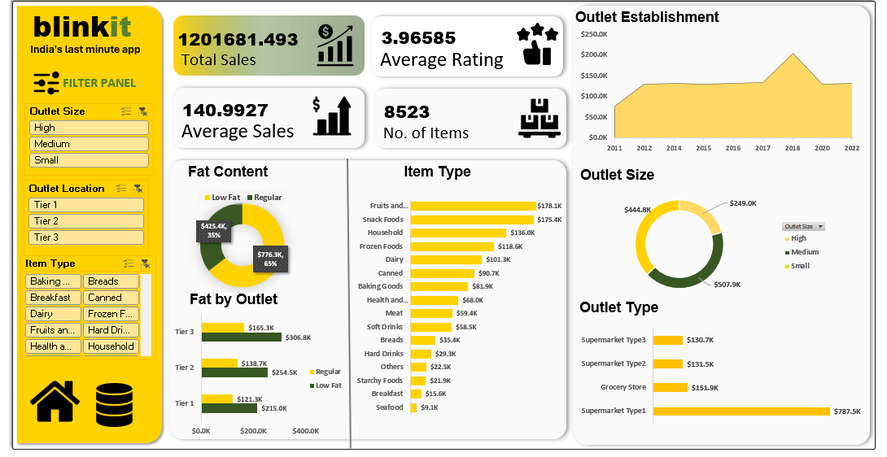

# 🛒 BlinkIT Grocery Sales Dashboard – Excel

## 📌 Project Overview

This project is an **Excel-based sales analysis and dashboard** built using BlinkIT grocery sales data. The dashboard analyzes sales performance, product categories, outlet performance, customer ratings, and location-wise trends using **Pivot Tables, Pivot Charts, KPIs, and interactive filters**.

The goal is to convert raw grocery sales data into meaningful business insights that can support better **sales, inventory, and outlet-level decision-making**.

---

## 📸 Dashboard Preview



---

## 🎯 Objectives

* Analyze overall BlinkIT sales performance
* Identify top-performing product categories
* Compare sales across different outlet types and sizes
* Analyze sales based on outlet location
* Understand the impact of fat content on sales
* Analyze outlet establishment trends
* Monitor customer ratings
* Build an interactive Excel dashboard for business reporting

---

## 🛠️ Tools & Techniques

* **Microsoft Excel**
* Data Cleaning & Preparation
* Excel Formulas
* Pivot Tables
* Pivot Charts
* KPI Cards
* Slicers / Filters
* Data Visualization
* Business Analysis

---

## 📊 Key KPIs

The dashboard focuses on important business metrics such as:

* **Total Sales:** $1,201,681.49
* **Average Sales:** $140.99
* **Number of Items:** 8,523
* **Average Customer Rating:** 3.97 ★
* **Sales by Item Type:** Fruits & Vegetables ($178.1K), Snack Foods ($175.4K), Household ($136.0K), etc.
* **Sales by Fat Content:** Low Fat (65% | $776.3K) vs. Regular (35% | $425.4K)
* **Sales by Outlet Type:** Supermarket Type1 ($787.5K), Grocery Store ($151.9K), Supermarket Type2 ($131.5K), Supermarket Type3 ($130.7K)
* **Sales by Outlet Size:** Medium ($507.9K), Small ($444.8K), High ($249.0K)
* **Sales by Outlet Location:** Tier 1, Tier 2, and Tier 3 location breakdowns
* **Sales by Outlet Establishment Year:** Historical performance tracking from 2011 to 2022

---

## 📂 Project Structure

```text
Blinkit Grocery Sales Dashboard/
│
├── 📊 BlinkIT Grocery Dashboard.xlsx
│   └── Main Excel workbook with data analysis, Pivot Tables, and interactive dashboard
│
├── 📁 assets/
│   ├── blinkit_sales_dashboard.png
│
└── 📄 README.md
    └── Project documentation
```

---

## 🔄 Project Workflow

```text
Raw Data → Data Cleaning → Data Analysis → Pivot Tables → KPI Creation → Charts & Visualization → Interactive Dashboard → Business Insights
```

---

## 📈 Dashboard Analysis

### 1. Sales Performance
Analyzed overall sales ($1.2M) and average sales ($140.99) across 8,523 items to understand baseline business performance.

### 2. Product Analysis
Compared different item categories to identify top revenue generators. **Fruits & Vegetables** ($178.1K) and **Snack Foods** ($175.4K) emerged as the top-selling categories.

### 3. Outlet Analysis
Evaluated sales across outlet types and sizes. **Supermarket Type 1** dominates revenue generation with **$787.5K**, while **Medium-sized outlets** lead across outlet sizes with **$507.9K**.

### 4. Location Analysis
Compared sales performance across Tier 1, Tier 2, and Tier 3 locations to identify geographical demand patterns.

### 5. Customer Analysis
Monitored average customer ratings (**3.97 / 5.0**) to gauge customer satisfaction across different item types and outlet tiers.

### 6. Fat Content Analysis
Analyzed sales distribution between Low Fat (65% share) and Regular fat products, indicating a strong customer preference for Low Fat grocery items.

---

## 💡 Business Insights

The dashboard helps identify:

* **High-demand Categories:** Fruits & Vegetables and Snack Foods drive the highest sales revenue.
* **Optimal Outlet Types:** Supermarket Type 1 generates significantly higher revenue compared to Grocery Stores and other supermarket types.
* **Customer Health Preferences:** Low Fat items account for 65% of total sales revenue ($776.3K), highlighting key stocking opportunities for inventory management.
* **Outlet Establishment Trends:** Peak expansion and sales spikes observed around 2018.

---

## 🚀 Key Learnings

Through this project, I strengthened my practical skills in:

* Excel Data Analysis
* Data Cleaning & Transformation
* Pivot Tables & Pivot Charts
* KPI Card Design & Layout Strategy
* Interactive Dashboard Design using Slicers
* Data Visualization
* Business Insight Generation

---

## 👩‍💻 Author

**Rishita Choksi**

**Data Analytics | Excel | SQL | Python | Power BI**

⭐ Explore the Excel dashboard to understand grocery sales performance and outlet analytics.
